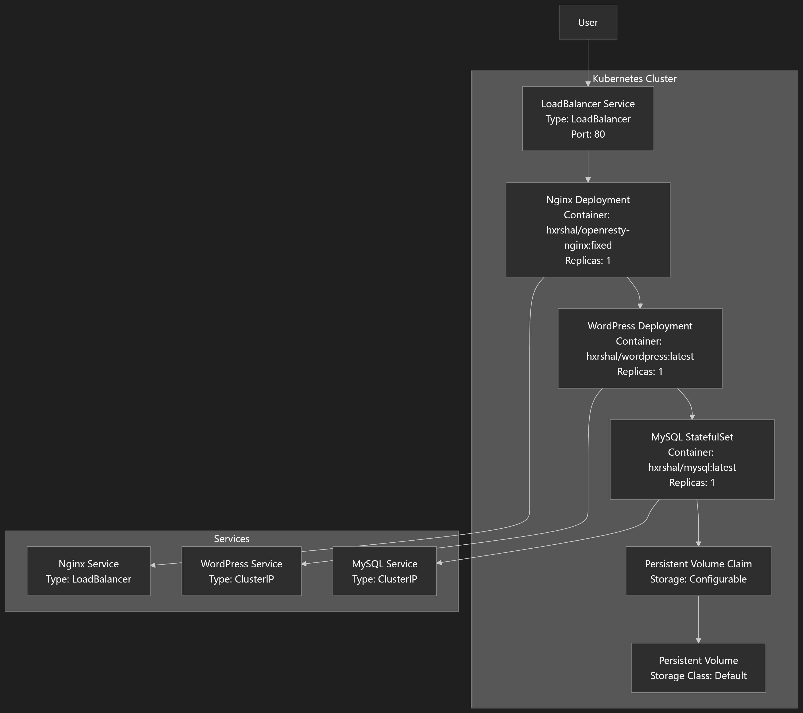
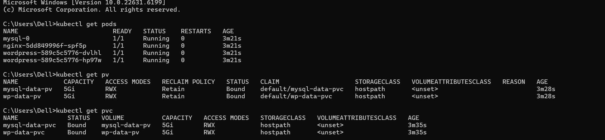
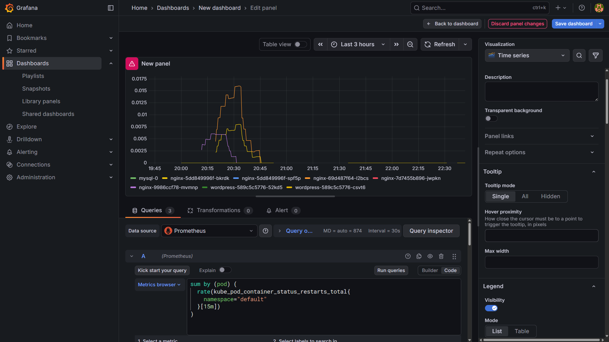
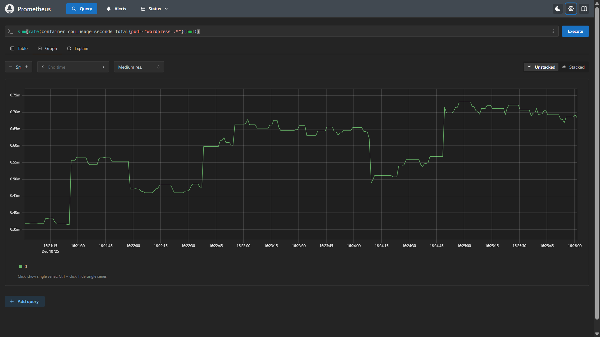

# WordPress on Kubernetes with Monitoring & Alerting

This project demonstrates a production-style deployment of WordPress on Kubernetes using Helm. It includes a reverse-proxy setup with Nginx (OpenResty), MySQL as a StatefulSet with persistent storage, and full observability using Prometheus and Grafana. The system is designed to be resilient, restart-safe, and monitorable with real CPU metrics and application-level alert definitions.

The goal of this project is to showcase real-world DevOps practices such as container orchestration, Helm-based deployments, persistent volumes, and observability.

## Tech Stack

- Kuebernetes
- Helm
- WordPress
- MySQL (StatefulSet)
- Prometheus
- Grafana
- OpenResty (Nginx)
- Alertmanager

# PART 1: Wordpress Infrastructure on Kubernetes

This section covers how the wordpress application is deployed and how persistence and networking are handled.

## Architecture Overview

User --> Nginx (Reverse Proxy) --> WordPress --> MySQL (StatefulSet)
Persistent storage is attached to MySQL using PersistentVolumeClaims (PVCs) and PersistentVolumes (PVs)



## Components
- **Wordpress** runs as a Kubernetes Deployment
- **MySQL** runs as a StatefulSet with persistent storage
- **Nginx(OpenResty)** acts as a reverse proxy infront of Wordpress
- **Persistent Volumes** ensure Wordpress data is not lost when pods restart
- All components are deployed using **Helm**

## Deployment Steps

```bash
helm install my-release ./helm/wordpress-stack
```
## Verify

```bash
kubectl get pods
kubectl get svc
kubectl get pvc
kubectl get pv
```

## Accessing

1. Wordpress
```bash
kubectl port-forward svc/nginx-service 8080:80
```
Then open http://localhost:8080 in your browser.

# PART 2: Monitoring & Alerting

This section covers how monitoring and alerting are implemented for the WordPress application.

## Architecture Overview

Prometheus --> Grafana <-- Alertmanager <-- Prometheus Alerts

## Components

- **Prometheus** collects metrics from WordPress and MySQL
- **Grafana** visualizes the metrics and provides dashboards
- **Alertmanager** handles alerts and notifications
- **Prometheus Alerts** define application-level alerting rules

## Deployment Steps

```bash
helm install prometheus ./helm/prometheus
helm install grafana ./helm/grafana
helm install alertmanager ./helm/alertmanager
```

## Verify

```bash
kubectl get pods -n monitoring
kubectl get svc -n monitoring
```

## Accessing Grafana

```bash
kubectl port-forward svc/grafana 32000:80 -n monitoring
```

Then open http://localhost:32000 in your browser.



## Accessing Prometheus

```bash
kubectl port-forward svc/prometheus-server 9090:80 -n monitoring
```

Then open http://localhost:9090 in your browser.



The following alerts are configured and visible in the Prometheus UI:

```bash
HighWordpressCpuUsage

HighNginx5xxRate
```
These alerts demonstrate the system’s ability to detect performance and server-side errors.

## Final Output
- After deployment, the system provides:
- A fully functional WordPress website on Kubernetes
- Persistent MySQL-backed storag
- Reverse proxy using Nginx
- Live CPU monitoring using Prometheus and Grafana
- Custom alert rules for application health
- A documented metrics and observability design