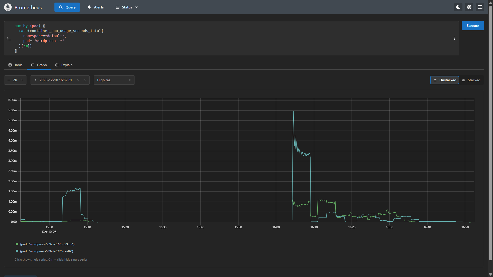
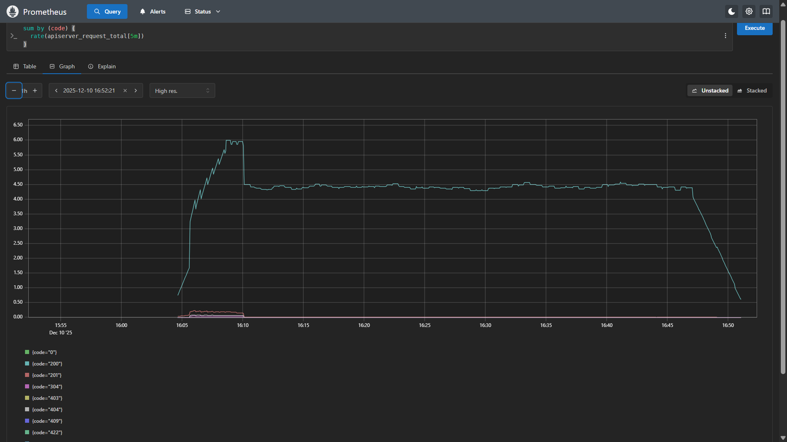

# Metrics Design Document
This document defines the required production-grade metrics for WordPress, Apache, and Nginx along with their purpose and usage. These metrics are essential for monitoring performance, reliability, and system health in a real-world deployment.

---

## 1. WordPress Metrics

WordPress runs as a PHP-based application, so most of its operational visibility comes from Kubernetes container metrics and database behavior.

### 1.1 Pod CPU Utilisation
Metric: container_cpu_usage_seconds_total
Purpose:
- Measures how much CPU WordPress pods are consuming.
- Helps detect performance bottlenecks under high traffic.
- Used for scaling and alerting.

Collection Method:
- Scraped automatically by kube-prometheus-stack via cAdvisor.

Alert Usage:
- Used in `HighWordpressCpuUsage` alert rule.

---

### 1.2 Pod Memory Usage
Metric: container_memory_usage_bytes
Purpose:
- Detects memory leaks and memory pressure.
- Prevents Out-Of-Memory (OOM) pod crashes.

Collection Method:
- Kubernetes container metrics via Prometheus.

---

### 1.3 Pod Restarts
Metric: kube_pod_container_status_restarts_total
Purpose:
- Detects application instability.
- Indicates crash loops or fatal WordPress errors.

---

### 1.4 HTTP Request Latency (Conceptual)
Metric: http_request_duration_seconds
Purpose:
- Measures how fast WordPress responds to users.
- Used for performance tuning and SLA tracking.

Collection Method:
- Application exporter or PHP instrumentation.

---

### 2.1 Total HTTP Request Count
Metric: nginx_http_requests_total
Purpose:
- Measures all incoming traffic.
- Used for traffic analysis and service load monitoring.

Collection Method:
- nginx-prometheus-exporter via `/stub_status`.

---

### 2.2 Total 5xx Server Errors
Metric: nginx_http_requests_total{status=~"5.."}
Purpose:
- Detects backend failures.
- Indicates application crashes or network failures.

Alert Usage:
- Used in `HighNginx5xxRate` alert rule.

---

### 2.3 Active Connections
Metric: nginx_connections_active
Purpose:
- Shows how many users are currently connected.
- Used to track traffic spikes.

---

### 2.4 Request Processing Time
Metric: nginx_http_request_duration_seconds
Purpose:
- Measures how long Nginx takes to process requests.
- Helps identify slow backend services.

---

